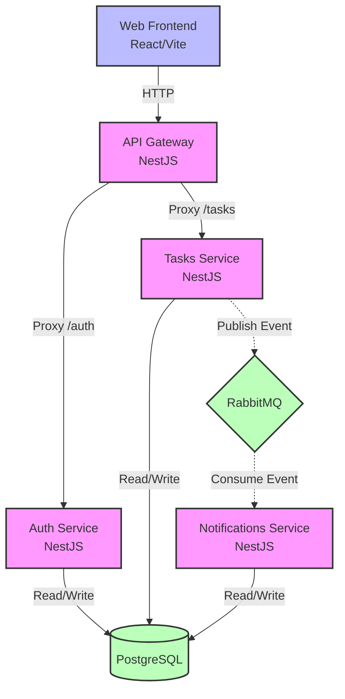

# MicroTask

MicroTask is a task management application built with a microservices architecture, organized in a monorepo using **Turborepo** and **pnpm workspaces**. It demonstrates a scalable approach to building distributed systems with modern technologies.

## 🚀 Tech Stack

### Frontend
- **React** (Vite)
- **TypeScript**
- **TanStack Router** (File-based routing)
- **Tailwind CSS** & **shadcn/ui**
- **Zustand** (State management)
- **TanStack Query** (Data fetching)

### Backend (Microservices)
- **NestJS** (Framework)
- **TypeORM** (ORM)
- **PostgreSQL** (Database)
- **RabbitMQ** (Message Broker)
- **Passport.js** (JWT Authentication)

### Infrastructure & DevOps
- **Turborepo** (Monorepo management)
- **pnpm** (Package manager)
- **Docker** & **Docker Compose** (Containerization)
- **Biome** (Linting & Formatting)

## 🏗️ Architecture

The project consists of several microservices coordinated through an API Gateway:

- **API Gateway:** Single entry point for the frontend, proxying requests to internal services via HTTP.
- **Auth Service:** Handles user registration, login, and JWT-based authentication.
- **Tasks Service:** Manages task CRUD operations and comments.
- **Notifications Service:** Consumes domain events via RabbitMQ to process and send real-time notifications.
- **Web Frontend:** A modern React application to interact with the system.

### Architecture Diagram



## ⚖️ Trade-offs & Technical Decisions

- **Single Database vs Database per Service**: While a strict microservices architecture often dictates a separate database for each service, this project utilizes a single PostgreSQL instance with logical separation through different schemas (`auth`, `tasks`, `notifications`). This trade-off significantly reduces infrastructure overhead for a study/demo project while still maintaining data boundary principles.
- **API Gateway Proxying**: Instead of implementing complex GraphQL federation or a dedicated reverse proxy like Nginx/Traefik, the API Gateway is built in NestJS using `http-proxy-middleware`. This allows us to keep the entire backend stack unified under NestJS, reducing the learning curve and context switching, even though a dedicated proxy might be more performant in high-scale scenarios.
- **Turborepo & pnpm**: The monorepo structure makes it much easier to share common logic, types, and ESLint/Biome configurations across all microservices and frontend, eliminating the need to publish internal libraries to a registry.
- **Docker Multi-stage Builds**: We utilize `turbo prune` in our Dockerfile. This ensures that when building a specific microservice's container image, only the required packages and dependencies are copied over, keeping image sizes small and build times fast.

## 🛠️ Getting Started

### Prerequisites
- [Node.js](https://nodejs.org/) (v18+)
- [pnpm](https://pnpm.io/)
- [Docker](https://www.docker.com/) & [Docker Compose](https://docs.docker.com/compose/)

### Installation & Execution (Docker Environment)

The easiest way to run the entire project is using Docker. This will spin up the database, message broker, all microservices, and the frontend web app.

1. Clone the repository:
   ```bash
   git clone <repository-url>
   cd micro-task
   ```

2. Start the infrastructure using Docker Compose:
   ```bash
   docker compose up --build
   ```

3. Access the web application at `http://localhost:3000`.

### Local Development (Without Docker for Apps)

If you prefer to run the applications locally to have a faster feedback loop during development:

1. Install dependencies:
   ```bash
   pnpm install
   ```

2. Start only the infrastructure dependencies (Postgres, RabbitMQ):
   ```bash
   docker-compose up -d db rabbitmq
   ```

3. Run the applications in development mode using Turborepo:
   ```bash
   pnpm dev
   ```

## 📖 Documentation

- [Roadmap](./ROADMAP.md) - Project progress and future phases.
- [Monorepo Documentation](./GEMINI.md) - Technical details about the monorepo structure (Portuguese).

## 📜 Scripts

Available in the root directory:

- `pnpm dev`: Start all apps in watch mode.
- `pnpm build`: Build all applications and packages.
- `pnpm lint`: Run linting across the workspace.
- `pnpm format`: Format all files using Biome.

---
Built with ❤️ as a demonstration of microservices architecture.
